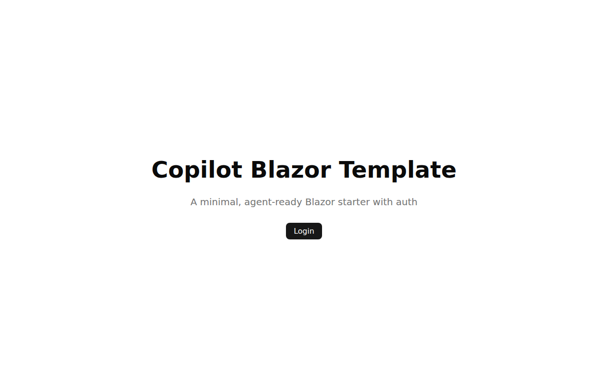
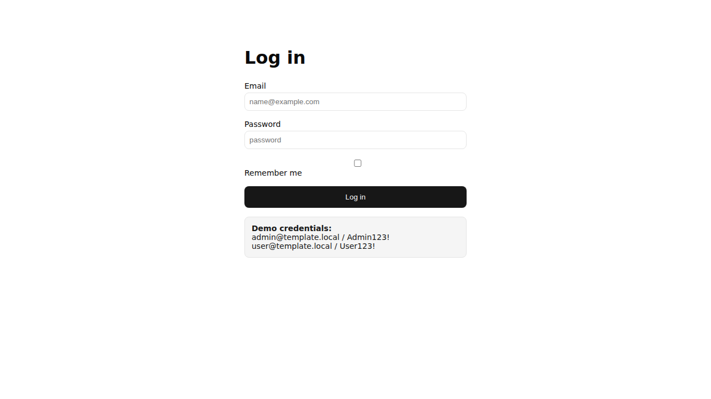
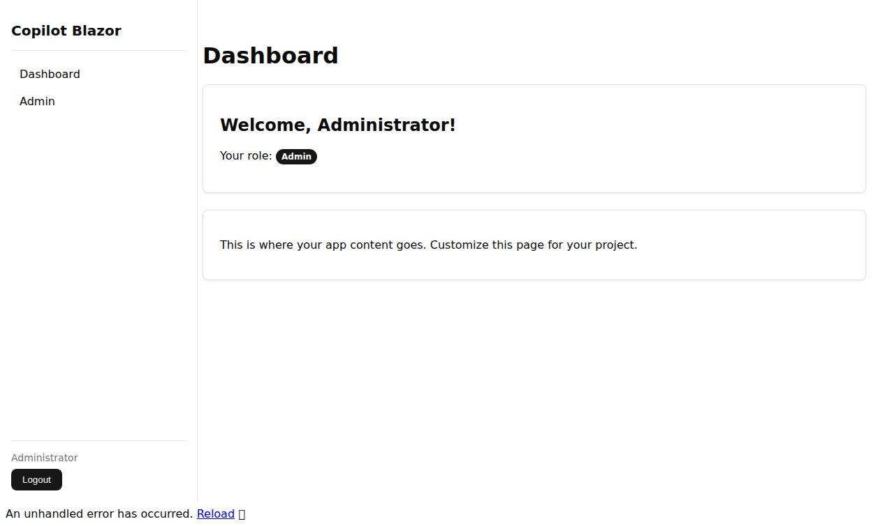
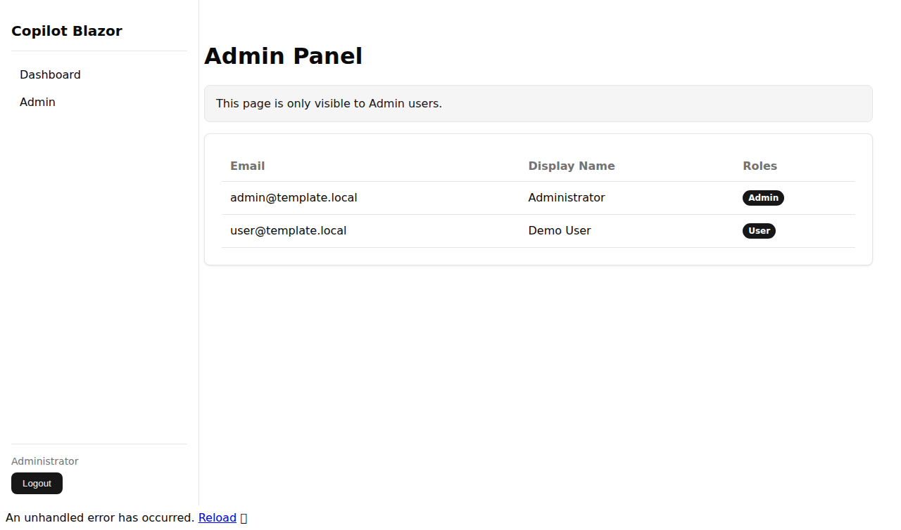

# 🚀 Copilot Blazor Template

[](https://github.com/rquintino/copilot-blazor-template/actions/workflows/ci.yml)

A minimal, agent-ready Blazor Web App starter with authentication, designed for rapid development with GitHub Copilot.

## Architecture

| Project | Purpose |
|---------|---------|
| `ITSupportDesk.Web` | Blazor Server app with Identity auth and UI |
| `ITSupportDesk.Core` | Domain entities, EF Core DbContext, data layer |
| `ITSupportDesk.UnitTests` | xUnit unit tests |
| `ITSupportDesk.E2ETests` | Playwright end-to-end tests |

## Quick Start

```bash
# Clone and run
git clone https://github.com/rquintino/copilot-blazor-template.git
cd copilot-blazor-template
dotnet run --project src/ITSupportDesk.Web
```

Open https://localhost:5001 (or the URL shown in console).

## Seeded Credentials

| Email | Password | Role |
|-------|----------|------|
| admin@template.local | Admin123! | Admin |
| user@template.local | User123! | User |

## Screenshots

| Landing | Login |
|---------|-------|
|  |  |

| Dashboard | Admin |
|-----------|-------|
|  |  |

## What's Included

- ✅ .NET 10 Blazor Web App
- ✅ ASP.NET Identity with seeded users (no registration)
- ✅ EF Core with SQLite
- ✅ Sidebar navigation with role-based visibility
- ✅ Custom theme (CSS variables, no Bootstrap)
- ✅ Unit tests (xUnit)
- ✅ E2E tests (Playwright)
- ✅ CI/CD with GitHub Actions
- ✅ Copilot agent support (AGENTS.md, instructions, skills)

## How to Use This Template

1. **Fork** this repository
2. **Add entities** to `src/ITSupportDesk.Core/Entities/`
3. **Add pages** to `src/ITSupportDesk.Web/Components/Pages/`
4. **Prompt Copilot** — the agent instructions and AGENTS.md guide AI assistance

## Agentic Productivity

This template is designed for autonomous GitHub Copilot agent workflows. All agent tooling, conventions, and guarantees are documented in **AGENTS.md**, the gold standard reference.

### Task Lifecycle

Tasks flow through a structured backlog system in the `tasks/` directory:

```
tasks/
├── backlog/        # New tasks, awaiting prioritization
├── current/        # Actively being worked on (in-progress)
└── done/           # Completed and verified
```

Each task is a **markdown folder** (e.g., `tasks/current/user-auth.md/`) containing:
- **Front matter** (YAML): title, description, acceptance criteria, blocked/unblocked status
- **Markdown body**: current progress, notes, and sub-task tracking
- **Verified outputs**: build logs, test runs, screenshots (embedded as task evidence)

### How Tasks Are Structured

```yaml
---
title: "Add Two-Factor Authentication"
description: "Implement TOTP-based 2FA for user login"
acceptance_criteria:
  - "Admin can enable/disable 2FA per user"
  - "Users see backup codes on enrollment"
  - "Login validates TOTP before session creation"
blocked: false
blocked_reason: null
---

## Progress

- [x] Create 2FA entity model
- [ ] Add service layer
- [ ] Create UI pages
```

### Independence Guarantees for Agents

All agent work is **stateless and isolated**:

- **No cross-session state**: Each agent invocation (orchestrator, sub-agent, or standard Copilot session) starts fresh. Tasks are the only persistent unit of work.
- **No git-push**: Agents commit locally; only `gh pr create` publishes. This avoids credential hangs in the cloud environment.
- **No pre-PR validation**: CodeQL and code review run as PR checks automatically. Running them mid-task can hang.
- **Skill triggers are explicit**: Each `.github/skills/<name>/SKILL.md` has a documented trigger condition (search pattern, file type, keyword match). Bootstrap explicitly checks that trigger before invoking.

### Bootstrap Workflow with AGENTS.md

When you invoke Copilot for a task:

1. **Copilot reads AGENTS.md first** — This is the gold-standard reference document. It contains:
   - Project structure
   - Skill registry and their trigger conditions
   - Exact commands for build, test, migrate, format
   - Seeded credentials
   - Conventions (namespaces, themes, database, render modes)
   - Task workflow and push/PR rules

2. **Check if bootstrap is needed**:
   ```bash
   grep -rIlq ITSupportDesk . --exclude-dir={.git,bin,obj,node_modules}
   ```
   - If **found** and user is asking for a **new app/feature/domain** → Invoke `bootstrap-new-app` skill to rename the template
   - If **not found** → Skip bootstrap; template is ready to use

3. **Invoke appropriate skills** per trigger conditions:
   - **task-orchestration** → Move tasks through `backlog/ → current/ → done/`
   - **validator** → Run after each phase (build + tests + format pass)
   - **screenshots-demo** → When UI pages are added/changed
   - **playwright-e2e** → When authoring E2E tests

4. **Complete the task** → Commit locally, then `gh pr create` (no push)

### Reference Documents

| Document | Purpose |
|----------|---------|
| **AGENTS.md** | Gold-standard agent workflow, skills, commands, conventions |
| **.github/instructions/** | Language-specific (Blazor, EFCore, Playwright) code guidelines |
| **.github/skills/** | Individual skill implementations with trigger conditions |

---

## Tech Stack

- .NET 10 · Blazor Server · ASP.NET Identity
- EF Core · SQLite
- xUnit · Playwright
- GitHub Actions

---

> Scaffolded by [plan-dotnet-app](https://github.com/rquintino/skills) v1.3.0